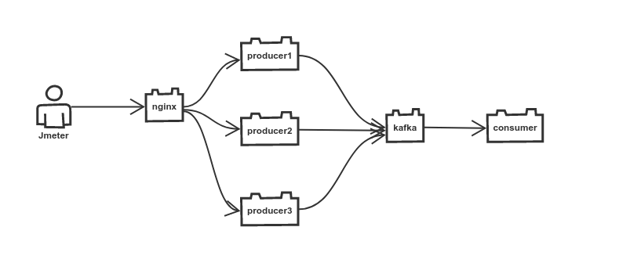

# kissa
Kissa is a subproject of Karhu. It is a benchmark test of Axon and Kafka.

## architecture to test throughput of kafka

## Tool and its version used in the performance testing

* kafka
* Jmeter
* nodejs
* visual studio code
* nginx
